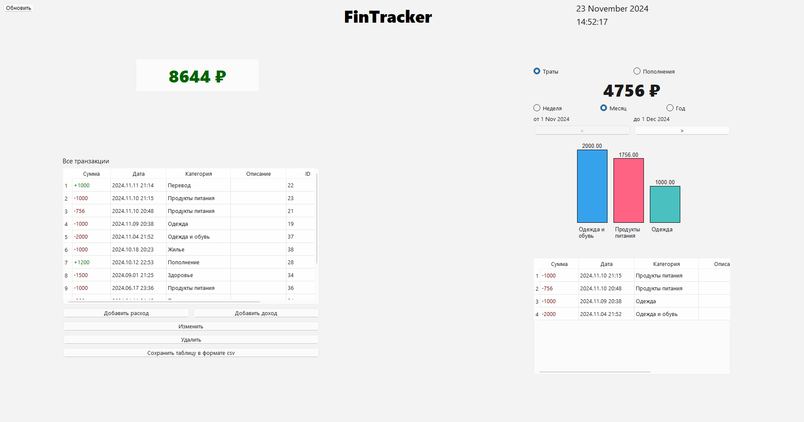

---

#  **FinTracker**  
**FinTracker** — это удобное и интуитивно понятное приложение для управления личными финансами. С его помощью вы сможете эффективно отслеживать свои доходы и расходы, анализировать траты и управлять бюджетом.  



---

## ✨ **Основные функции**  
- 🔹 Добавление доходов и расходов с указанием категорий и описаний.  
- 🔹 Просмотр всех транзакций с возможностью редактирования и удаления.  
- 🔹 Фильтрация данных по временным периодам: неделя, месяц, год.  
- 🔹 Интерактивные графики для анализа расходов и доходов.  
- 🔹 Экспорт данных в формате CSV для дальнейшей обработки.  

---

## 🚀 **Установка и запуск**  

### 🛠 **Системные требования**  
- **Python**: версия 3.9 или выше.  
- **Операционная система**: Windows, macOS или Linux.  
- **Дополнительные зависимости**: установите из файла `requirements.txt`.  

### 🔧 **Шаги установки**  
1. Склонируйте проект на свой компьютер:  
   ```bash  
   git clone https://github.com/stepa323/FinTracker.git
   cd fintracker  
   ```  

2. Установите необходимые зависимости:  
   ```bash  
   pip install -r requirements.txt  
   ```  

3. Запустите приложение:  
   ```bash  
   python main.py  
   ```  

---

## 📝 **Список зависимостей**  
В проекте используются следующие библиотеки Python:  
```text  
altgraph==0.17.4  
DateTime==5.5  
packaging==24.2  
pefile==2023.2.7  
pyinstaller==6.11.1  
pyinstaller-hooks-contrib==2024.10  
PyQt6==6.7.1  
PyQt6-Qt6==6.7.3  
PyQt6_sip==13.8.0  
pytz==2024.2  
pywin32-ctypes==0.2.3  
setuptools==75.3.0  
zope.interface==7.1.1  
```  
Для удобства все зависимости включены в файл `requirements.txt`.

---

## 🎯 **Использование**  
1. **Добавление транзакций**:  
   - Нажмите кнопку **"Добавить доход"** или **"Добавить расход"**.  
   - Укажите сумму, категорию и описание.  
2. **Фильтрация данных**:  
   - Выберите интересующий вас временной период: неделя, месяц, год.  
3. **Экспорт таблицы**:  
   - Нажмите кнопку **"Сохранить таблицу в формате CSV"** для выгрузки данных.  

---

## 📂 **Структура проекта**  
- **`main.py`** — основной файл для запуска приложения.  
- **`db.sqlite`** — база данных SQLite для хранения транзакций.  
- **`ui`** — интерфейс, созданный на PyQt6.  

---

## ⚖ **Лицензия**  
Проект распространяется под лицензией **MIT**. Вы можете свободно использовать, модифицировать и распространять его.  

---

Если у вас есть дополнительные вопросы или вы хотите внести вклад, оставьте свой отзыв или создайте Pull Request! 🙌

--- 
